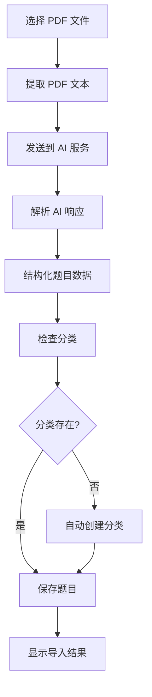

# AI PDF 导入功能设计

> **For Claude:** REQUIRED SUB-SKILL: Use superpowers:executing-plans to implement this plan task-by-task.

**Goal:** 实现使用现成 AI 服务识别 PDF 文本内容并自动导入题库的功能，支持自动分类和分类自动创建。

**Architecture:** 采用主进程处理 PDF 提取和 AI 调用，渲染进程提供用户界面和结果展示。通过配置系统支持多种 AI 服务，统一接口处理识别结果。

**Tech Stack:** pdf-parse (PDF 文本提取)、axios (HTTP 请求)、配置管理系统、UI 组件

---

## 架构设计

### 1. 核心组件

#### 主进程 (src/main/)
- **pdfProcessor.ts** - PDF 文本提取
- **aiService.ts** - AI 服务统一接口
- **questionParser.ts** - AI 结果解析和题目结构化
- **categoryManager.ts** - 分类管理

#### 渲染进程 (src/renderer/src/)
- **views/Import.vue** - 导入界面
- **components/PdfPreview.vue** - PDF 预览组件
- **components/QuestionList.vue** - 题目列表展示
- **components/AiConfig.vue** - AI 配置面板
- **stores/importStore.ts** - 导入状态管理

### 2. 数据流程



### 3. AI 服务设计

#### 配置结构
```typescript
interface AiServiceConfig {
  provider: 'openai' | 'baidu' | 'aliyun' | 'custom'
  apiKey: string
  endpoint?: string
  model: string
  temperature?: number
  maxTokens?: number
  promptTemplate: string
}
```

#### 统一接口
```typescript
class AiService {
  async extractQuestions(pdfText: string): Promise<ExtractedQuestion[]> {
    // 根据配置调用不同的 AI 服务
  }
}
```

### 4. 题目识别规则

#### 题目格式识别
- **单选题**：题号 + 题干 + A/B/C/D 选项 + 正确答案
- **多选题**：题号 + 题干 + A/B/C/D 选项 + 多个答案
- **填空题**：题号 + 题干 + ______ + 答案
- **简答题**：题号 + 题干 + 答案

#### 分类提取规则
- 从题目来源、章节、章节号等信息中提取
- 使用 AI 的分类能力自动判断
- 支持父子分类结构

### 5. 用户界面设计

#### 导入页面布局
1. **文件选择区**
   - 拖拽上传支持
   - 文件列表显示
   - 文件预览

2. **AI 配置面板**
   - 服务选择下拉框
   - API Key 输入
   - 模型选择
   - 参数调整

3. **识别结果区**
   - 分类树形展示
   - 题目列表预览
   - 编辑和确认功能

4. **操作按钮**
   - 开始识别
   - 批量确认
   - 取消

### 6. 关键功能实现

#### PDF 文本提取
```typescript
// 使用 pdf-parse 库
const pdfText = await pdfParse(fs.readFileSync(pdfPath))
```

#### AI Prompt 模板
```prompt
请分析以下文本，提取所有题目并按照 JSON 格式返回：
{
  "categories": [{"name": "分类名", "parentId": 0}],
  "questions": [{
    "title": "题目标题",
    "content": "题目内容",
    "type": "single|multiple|fill|essay",
    "options": ["选项A", "选项B"],
    "answer": "正确答案",
    "analysis": "解析"
  }]
}
```

#### 批量处理优化
- 支持大文件分页处理
- 进度显示
- 错误重试机制

### 7. 状态管理

```typescript
// importStore
const importState = ref({
  selectedFiles: [],
  processing: false,
  progress: 0,
  categories: [],
  questions: [],
  currentStep: 'select' // select, config, preview, complete
})
```

### 8. 错误处理

1. **PDF 解析失败**
   - 文件格式不支持
   - 文件损坏

2. **AI 服务调用失败**
   - API Key 无效
   - 网络错误
   - 服务超时

3. **解析结果异常**
   - JSON 格式错误
   - 必填字段缺失
   - 数据格式不正确

### 9. 性能优化

- 大文件分块处理
- 识别结果缓存
- 批量保存优化
- UI 响应优化

### 10. 扩展性设计

- 支持添加新的 AI 服务提供商
- 支持自定义 prompt 模板
- 支持多种题目格式识别规则
- 支持导入历史记录